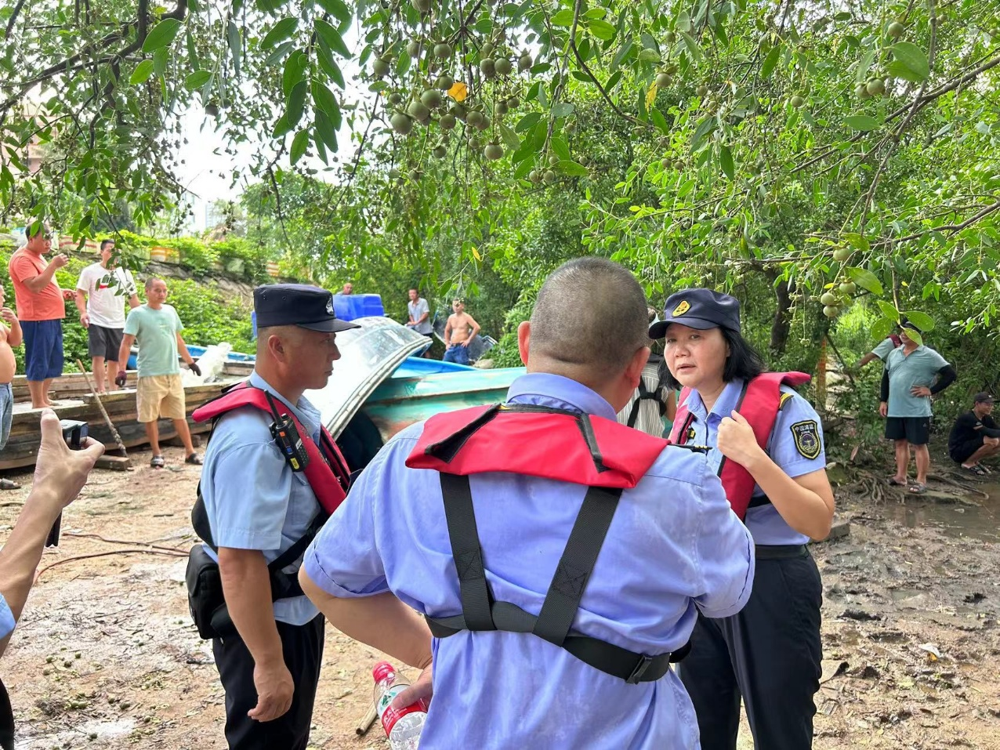
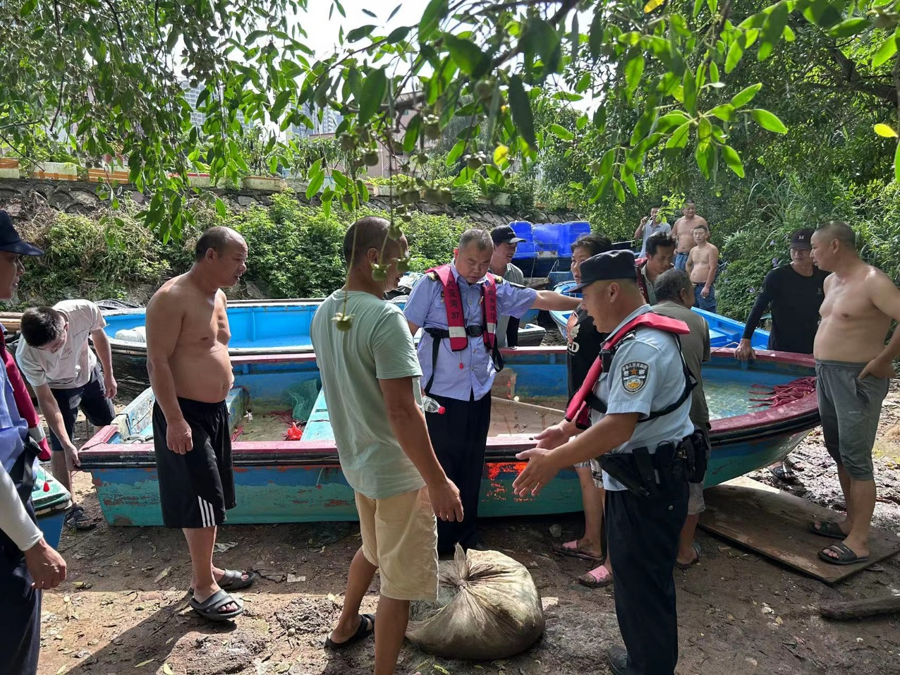
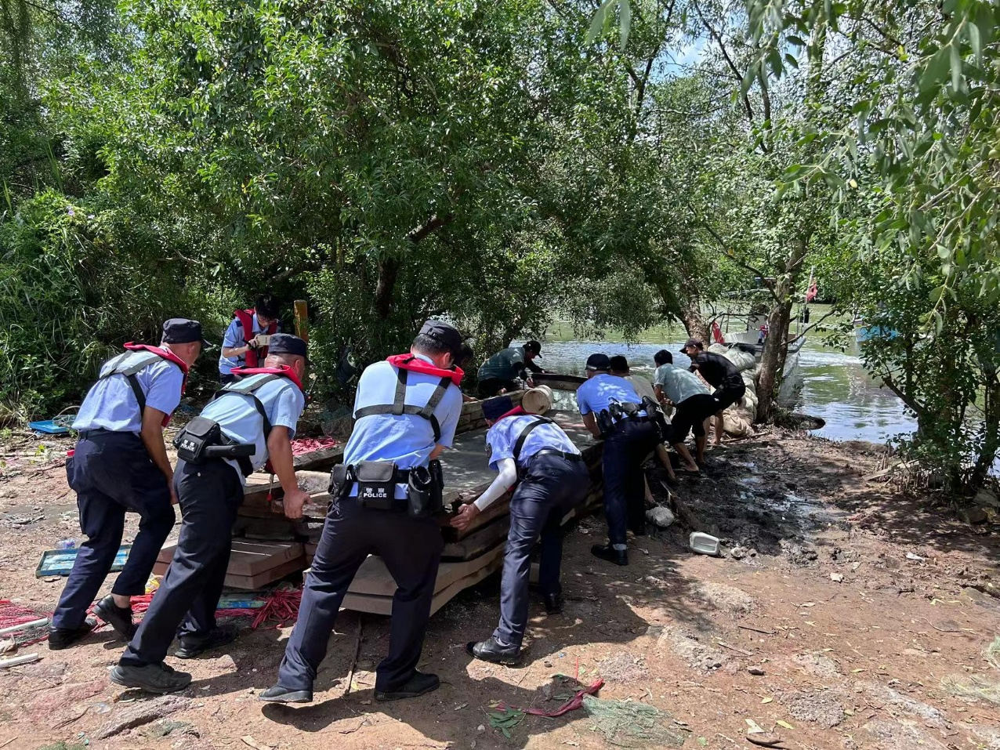
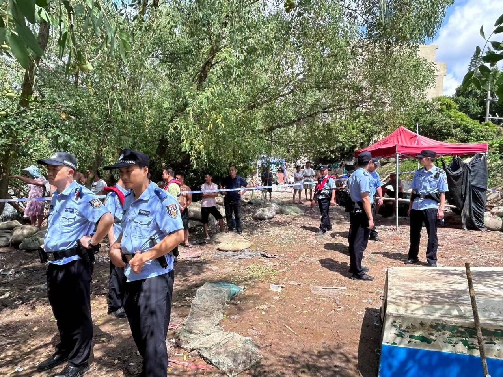
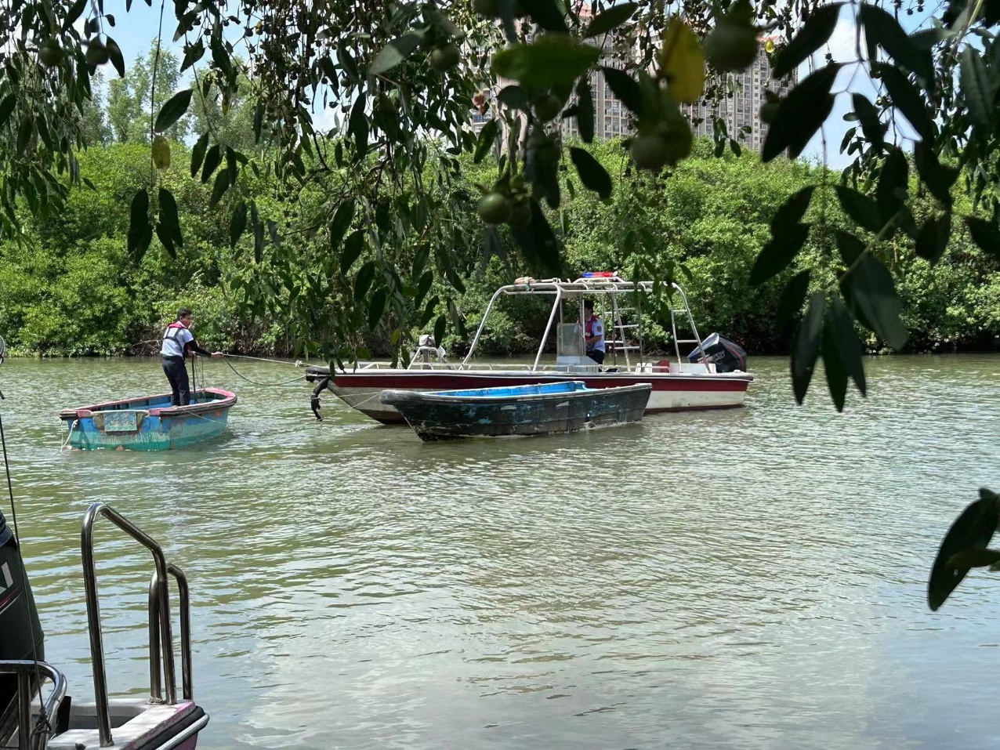
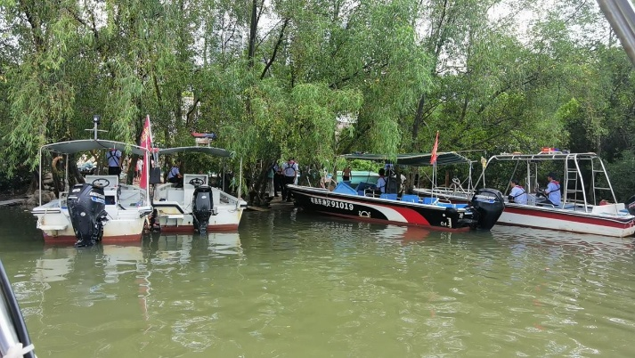

# 大亚湾区开展夏季治安打击整治行动暨开渔海上治安秩序联合整治行动

为扎实推进我区反走私反偷渡工作，以实际行动确保开渔前后社会面治安秩序平稳可控，按照夏季治安打击整治行动工作部署，8月15日上午，区打私办牵头联合区公安分局海岛大队、中心区派出所、澳头派出所，惠州港海关缉私分局、区社管局等海上执法部门开展夏季治安打击整治行动暨开渔海上治安秩序联合整治行动。

行动中，执法工作人员围绕沿海码头港口、船舶进出海上闸口、沿线易上岸点、澳头及三门岛重点海域等部位开展车巡及船巡，对可疑人员、可疑船只进行逐一细致排查，对巡查过程中发现的“三无”船舶予以查扣。同时，执法人员向渔船民派发宣传单，普及开渔相关法律法规并开展反走私反偷渡法制宣传教育，引导渔民等重要群体人员自觉遵守开渔秩序及抵制各类走私偷渡违法犯罪。

期间，共出动执法力量35人次、执法船艇6艘次、车辆5辆次、无人机2架次，检查人员158人、船舶83艘，查扣“三无”船舶20艘。通过行动有效清除了一批涉走私偷渡安全隐患，进一步净化了开渔作业海上环境，为下步开渔后的海上秩序平稳打下坚实基础。

